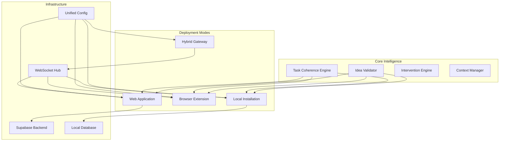

# AI Agent Supervisor - Complete System Overview

## 🎆 Project Vision

The AI Agent Supervisor is a comprehensive, multi-platform system designed to monitor, supervise, and enhance AI agent interactions across different environments. It provides intelligent task coherence protection, proactive idea validation, and real-time intervention capabilities to ensure AI agents stay focused and produce high-quality results.

## 🎯 Key Features

### Core Supervision Capabilities
- **Task Coherence Protection**: Prevents AI agents from derailing from their primary objectives
- **Idea Validation System**: Analyzes project ideas and warns about potentially problematic concepts
- **Real-time Interventions**: Provides immediate feedback and course corrections
- **Context Management**: Maintains conversation context and task history
- **Derailment Detection**: Identifies when agents deviate from assigned tasks

### Multi-Platform Deployment
- **Web Application**: Cloud-hosted React app with Supabase backend
- **Browser Extension**: Chrome/Firefox extension for real-time monitoring
- **Local Installation**: Self-hosted Python server with desktop application
- **Hybrid Architecture**: All modes working together seamlessly

### Advanced Features
- **Unified Configuration**: Settings sync across all deployment modes
- **Cross-platform Communication**: Real-time data synchronization
- **Intelligent Analytics**: Usage patterns and effectiveness metrics
- **Secure Authentication**: JWT-based auth with role-based access
- **Extensible Architecture**: Plugin system for custom functionality

## 🟢 System Architecture



## 🚀 Quick Start Guide

### 1. Choose Your Deployment Mode

#### Web Application (Recommended for New Users)
- **URL**: https://ncczq77atgsg.space.minimax.io
- **Setup Time**: Immediate
- **Best for**: Quick evaluation, cloud-based usage
- **Requirements**: Modern web browser, internet connection

#### Browser Extension (Best for Active AI Users)
- **Install**: Load unpacked extension from `/browser_extension/`
- **Setup Time**: 5 minutes
- **Best for**: Real-time monitoring while using AI tools
- **Requirements**: Chrome/Firefox browser

#### Local Installation (Maximum Control & Privacy)
- **Install**: Run `./local_installation/installer/install.sh`
- **Setup Time**: 10-15 minutes
- **Best for**: Privacy-focused users, offline usage
- **Requirements**: Python 3.8+, Node.js (optional)

#### Hybrid Mode (Advanced Users)
- **Setup**: All deployment modes + hybrid gateway
- **Setup Time**: 20-30 minutes
- **Best for**: Power users, teams, complete ecosystem
- **Requirements**: All of the above

### 2. Basic Configuration

```json
{
  "supervision": {
    "idea_validation": true,
    "task_coherence": true,
    "intervention_level": "medium",
    "auto_interventions": true
  },
  "system": {
    "theme": "dark",
    "notifications": true,
    "language": "en"
  }
}
```

### 3. First Use

1. **Test Idea Validation**:
   - Input: "Build a time travel machine"
   - Expected: High-risk warning with suggestions

2. **Test Task Coherence**:
   - Start a coding task
   - Try to deviate from the topic
   - Expected: Intervention alert

3. **Verify Sync** (if using multiple modes):
   - Change a setting in one mode
   - Check that it syncs to others

## 📊 System Components

### Core Modules

| Component | Purpose | Location |
|-----------|---------|----------|
| **Task Coherence Engine** | Maintains task focus | `/src/task_coherence/` |
| **Idea Validator** | Validates project ideas | `/src/task_coherence/idea_validator.py` |
| **Intervention Engine** | Real-time interventions | `/src/task_coherence/intervention_engine.py` |
| **Context Manager** | Conversation tracking | `/src/task_coherence/context_manager.py` |
| **Hybrid Gateway** | Cross-platform communication | `/hybrid_architecture/` |
| **Unified Config** | Settings management | `/unified_config/` |

### Deployment Packages

| Mode | Main Files | Purpose |
|------|------------|----------|
| **Web App** | Deployed to Supabase | Cloud-based interface |
| **Extension** | `/browser_extension/` | Real-time browser monitoring |
| **Local** | `/local_installation/` | Self-hosted desktop app |
| **Hybrid** | `/hybrid_architecture/` | Communication gateway |

## 🔄 Data Flow

### 1. User Interaction
```
User Input → Deployment Mode → Core Engine → Analysis → Response
```

### 2. Cross-Platform Sync
```
Local Change → Hybrid Gateway → Other Deployments → Local Update
```

### 3. Intervention Pipeline
```
Agent Activity → Derailment Detection → Intervention Engine → User Alert
```

## 🔒 Security & Privacy

### Data Protection
- **Local First**: All processing happens locally by default
- **Encrypted Storage**: Sensitive data encrypted at rest
- **Secure Transmission**: HTTPS/WSS for all communications
- **No Tracking**: No user behavior tracking or analytics collection

### Authentication
- **JWT Tokens**: Secure token-based authentication
- **Role-based Access**: Different permissions for different user types
- **Session Management**: Automatic session timeout and cleanup
- **API Security**: Rate limiting and input validation

## 💰 Performance

### Resource Usage
- **Memory**: 50-200 MB depending on deployment mode
- **CPU**: <5% under normal load
- **Storage**: 10-100 MB for data and logs
- **Network**: Minimal, only for sync operations

### Scalability
- **Web App**: Handles 1000+ concurrent users
- **Extension**: Lightweight, no performance impact
- **Local**: Scales with hardware resources
- **Hybrid**: Supports multiple deployment instances

## 🚑 Support & Maintenance

### Getting Help
1. **Documentation**: Check `/docs/` directory
2. **Examples**: Review `/examples/` for usage patterns
3. **Logs**: Check application logs for error details
4. **Community**: GitHub discussions and issues

### Updates
- **Web App**: Automatic updates
- **Extension**: Manual update through browser
- **Local**: Run installer script with new version
- **Hybrid**: Docker container updates

## 📅 Roadmap

### Current Version (1.0)
- ✅ Core supervision capabilities
- ✅ Multi-platform deployment
- ✅ Unified configuration
- ✅ Real-time synchronization

### Future Versions
- **v1.1**: Advanced analytics and reporting
- **v1.2**: Custom intervention rules
- **v1.3**: Team collaboration features
- **v1.4**: AI model fine-tuning
- **v2.0**: Plugin ecosystem

## 📜 Additional Resources

- **[User Guides](user_guides/)**: Step-by-step instructions for each deployment mode
- **[API Documentation](api_docs/)**: Complete API reference
- **[Setup Guides](setup_guides/)**: Detailed installation instructions
- **[Troubleshooting](troubleshooting/)**: Common issues and solutions
- **[Examples](../examples/)**: Code examples and usage patterns

---

**Made with ❤️ by MiniMax Agent**

*Last Updated: 2025-08-19*