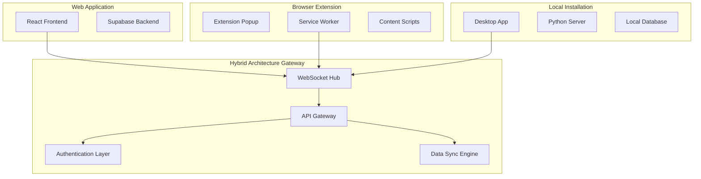

# AI Agent Supervisor - Hybrid Architecture System

This system enables seamless communication between all four deployment modes of the AI Agent Supervisor:

## Deployment Modes

1. **Web Application** - Cloud-hosted React app with Supabase backend
2. **Browser Extension** - Client-side monitoring with local storage
3. **Local Installation** - Self-hosted Python server with desktop app
4. **Hybrid Mode** - All modes working together in sync

## Architecture Overview



## Key Features

### Real-time Communication
- WebSocket-based messaging between all deployment modes
- Automatic reconnection and offline support
- Message queuing and synchronization

### Cross-Deployment Data Sync
- Settings synchronization across all modes
- Task and activity history sharing
- Intervention alerts broadcast to all connected modes

### Authentication Bridge
- JWT-based authentication across deployments
- Secure token sharing between modes
- User session management

### Message Router
- Intelligent message routing based on deployment mode
- Broadcast and targeted messaging support
- Message history and audit trails

## Installation & Setup

### 1. Start the Hybrid Gateway

```bash
cd hybrid_architecture
pip install -r requirements.txt
uvicorn main:app --host 0.0.0.0 --port 8888
```

### 2. Configure Environment

Create `.env` file:
```env
SUPABASE_URL=your_supabase_url
SUPABASE_ANON_KEY=your_supabase_anon_key
SUPABASE_SERVICE_ROLE_KEY=your_supabase_service_key
JWT_SECRET=your_jwt_secret_key
```

### 3. Deploy with Docker

```bash
docker build -t ai-supervisor-hybrid .
docker run -p 8888:8888 -v $(pwd)/.env:/app/.env ai-supervisor-hybrid
```

## API Endpoints

### WebSocket Connection
```
ws://localhost:8888/ws?user_id={user_id}&deployment_mode={mode}&auth_token={token}
```

### REST API
- `GET /api/v1/status` - System status across all deployments
- `POST /api/v1/sync` - Trigger data synchronization
- `POST /api/v1/message` - Send cross-deployment message
- `GET /api/v1/connections` - List active connections
- `GET /api/v1/history` - Message history
- `POST /api/v1/auth/token` - Generate auth token

## Message Format

All messages follow this standard format:

```json
{
  "message_id": "uuid",
  "type": "sync|intervention|task_update|idea_validation",
  "source_mode": "web|extension|local|hybrid",
  "target_mode": "web|extension|local|null",
  "user_id": "user_identifier",
  "payload": {},
  "timestamp": "ISO_datetime"
}
```

## Security Considerations

- JWT tokens for authentication
- CORS configuration for web access
- WebSocket origin validation
- Rate limiting on API endpoints
- Secure token storage in browser extension

## Monitoring & Debugging

- Real-time connection statistics at `/stats`
- WebSocket message logging
- Error handling and recovery
- Health check endpoints

## Production Deployment

For production, update the endpoints in the browser extension:

1. Replace `ws://localhost:8888` with your production WebSocket URL
2. Configure proper SSL certificates for WSS connections
3. Set up proper authentication with your Supabase project
4. Configure CORS origins for your domains
5. Set up monitoring and logging infrastructure