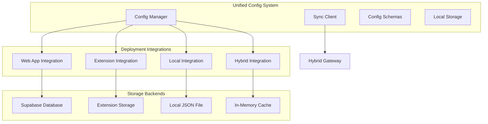

# Unified Configuration System

The Unified Configuration System provides centralized configuration management across all deployment modes of the AI Agent Supervisor.

## Overview

This system enables:
- **Cross-platform sync**: Settings automatically sync between web app, browser extension, local installation, and hybrid gateway
- **Conflict resolution**: Smart handling of configuration conflicts when multiple modes modify settings
- **Real-time updates**: Configuration changes propagate instantly across all connected deployments
- **Schema validation**: Type-safe configuration with validation rules
- **Version control**: Configuration versioning and rollback capabilities

## Architecture



## Core Components

### ConfigManager
Central configuration manager that handles:
- Configuration storage and retrieval
- Schema validation
- Default value management
- Export/import functionality

### SyncClient
Handles real-time synchronization:
- WebSocket communication with hybrid gateway
- Automatic sync scheduling
- Conflict detection and resolution
- Event handling for configuration changes

### Deployment Integrations
Specialized integrations for each deployment mode:
- **Web App**: Supabase storage, React state updates
- **Browser Extension**: Chrome storage API, content script updates
- **Local Installation**: File-based storage, desktop app updates
- **Hybrid Gateway**: Central coordination, broadcast capabilities

## Configuration Schema

### System Settings
```json
{
  "system.theme": {
    "type": "string",
    "default": "dark",
    "enum": ["dark", "light", "auto"],
    "sync": true
  },
  "system.language": {
    "type": "string", 
    "default": "en",
    "sync": true
  },
  "system.notifications": {
    "type": "boolean",
    "default": true,
    "sync": true
  }
}
```

### Supervision Settings
```json
{
  "supervision.idea_validation": {
    "type": "boolean",
    "default": true,
    "sync": true
  },
  "supervision.task_coherence": {
    "type": "boolean",
    "default": true,
    "sync": true
  },
  "supervision.intervention_level": {
    "type": "string",
    "default": "medium",
    "enum": ["low", "medium", "high"],
    "sync": true
  }
}
```

### Deployment-Specific Settings
```json
{
  "extension.auto_detect_agents": {
    "type": "boolean",
    "default": true,
    "scope": "deployment",
    "sync": false
  },
  "local.server_port": {
    "type": "number",
    "default": 8889,
    "scope": "deployment",
    "sync": false
  }
}
```

## Usage Examples

### Basic Configuration Management

```python
from unified_config import get_config_manager, DeploymentMode

# Initialize for web app
config = get_config_manager(DeploymentMode.WEB)

# Get configuration values
theme = config.get('system.theme')  # Returns 'dark'
idea_validation = config.get('supervision.idea_validation')  # Returns True

# Set configuration values
config.set('system.theme', 'light')
config.set('supervision.intervention_level', 'high')

# Get all configuration
all_config = config.get_all_config()
```

### Real-time Synchronization

```python
from unified_config import ConfigSyncClient

# Create sync client
sync_client = ConfigSyncClient(config, "ws://localhost:8888/ws")

# Connect to hybrid gateway
await sync_client.connect()

# Enable auto-sync
sync_client.auto_sync = True

# Manual sync
await sync_client.sync_configuration()

# Handle sync events
def on_config_changed(event, data):
    print(f"Config changed: {data['key']} = {data['value']}")

sync_client.add_event_handler(SyncEvent.CONFIG_CHANGED, on_config_changed)
```

### Deployment Integration

```python
from unified_config import create_integration, DeploymentMode

# Create web app integration
integration = create_integration(
    DeploymentMode.WEB,
    config,
    supabase_client=supabase_client
)

# Initialize integration
await integration.initialize()

# Apply configuration change
await integration.apply_config_change('system.theme', 'light')

# Get deployment status
status = integration.get_deployment_status()
```

## Configuration Scopes

### User Scope
Settings that are user-specific and sync across all deployments:
- UI preferences (theme, language)
- Supervision settings
- Notification preferences

### System Scope
System-wide settings that affect all users:
- Server configuration
- Security settings
- Feature flags

### Deployment Scope
Settings specific to each deployment mode:
- Port numbers for local installation
- Extension permissions
- Web app session timeouts

### Temporary Scope
Session-only settings that don't persist:
- Current task context
- Temporary UI states
- Debug flags

## Synchronization Process

### 1. Configuration Change
```
User changes setting → Config Manager → Validation → Local Storage
```

### 2. Sync Propagation  
```
Local Storage → Sync Client → Hybrid Gateway → Other Deployments
```

### 3. Conflict Resolution
```
Conflict Detected → Version Comparison → User Resolution → Sync Complete
```

## Storage Backends

### Web Application
- **Primary**: Supabase database
- **Secondary**: Browser localStorage
- **Sync**: Real-time through WebSocket

### Browser Extension
- **Primary**: Chrome storage API
- **Secondary**: Extension memory
- **Sync**: Through hybrid gateway

### Local Installation
- **Primary**: JSON file in user directory
- **Secondary**: SQLite database
- **Sync**: WebSocket to hybrid gateway

### Hybrid Gateway
- **Primary**: In-memory cache
- **Secondary**: Redis (optional)
- **Sync**: Central coordination point

## Conflict Resolution

### Automatic Resolution
1. **Last Write Wins**: Most recent timestamp
2. **Version Priority**: Higher version number
3. **Source Priority**: User vs system changes

### Manual Resolution
1. **Conflict Detection**: Multiple versions of same key
2. **User Notification**: Present available options
3. **User Choice**: Select preferred version
4. **Propagation**: Sync chosen version across deployments

## Security Considerations

### Data Protection
- Configuration encryption for sensitive values
- JWT tokens for authentication
- HTTPS/WSS for transmission
- Input validation and sanitization

### Access Control
- User-based configuration isolation
- Admin-only system settings
- Deployment-specific restrictions
- API rate limiting

## Performance Optimization

### Caching
- In-memory configuration cache
- Lazy loading of unused settings
- Batch updates for multiple changes
- Compression for sync payloads

### Network Efficiency
- Delta synchronization (only changes)
- Connection pooling
- Heartbeat optimization
- Automatic reconnection

## Monitoring and Debugging

### Logging
- Configuration change audit trail
- Sync operation logs
- Conflict resolution history
- Error tracking and reporting

### Metrics
- Sync frequency and latency
- Conflict occurrence rates
- Storage usage statistics
- Connection health metrics

## Future Enhancements

- **Configuration Templates**: Predefined setting bundles
- **A/B Testing**: Gradual rollout of configuration changes
- **Configuration History**: Time-based configuration snapshots
- **Smart Defaults**: ML-based default value optimization
- **Configuration Validation**: Advanced rule-based validation